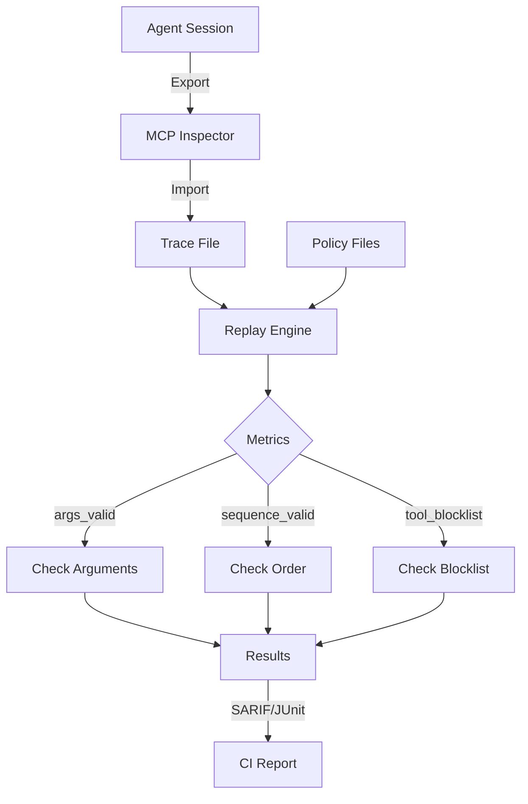

# Core Concepts

Understand the building blocks of Assay.

---

## Overview

Assay is built on four core concepts:

```
┌─────────────┐     ┌─────────────┐     ┌─────────────┐     ┌─────────────┐
│   Traces    │ ──► │  Policies   │ ──► │   Metrics   │ ──► │   Replay    │
│  (record)   │     │  (define)   │     │  (validate) │     │  (execute)  │
└─────────────┘     └─────────────┘     └─────────────┘     └─────────────┘
```

1. **Traces** — Recorded agent behavior (the "what happened")
2. **Policies** — Validation rules (the "what's correct")
3. **Metrics** — Validation functions (the "how to check")
4. **Replay** — Deterministic execution (the "how to test")

---

## The Testing Flow



---

## Concepts in Depth

<div class="grid cards" markdown>

-   :material-file-document-multiple:{ .lg .middle } __Traces__

    ---

    Recorded agent sessions in a normalized format. The "golden" behavior you test against.
    
    - What is a trace?
    - Trace format (JSONL)
    - Creating and managing traces
    - Fingerprinting

    [:octicons-arrow-right-24: Traces](traces.md)

-   :material-shield-check:{ .lg .middle } __Policies__

    ---

    Rules that define "correct" behavior for tool arguments.
    
    - Policy structure
    - Constraint types
    - Built-in formats
    - Real-world examples

    [:octicons-arrow-right-24: Policies](policies.md)

-   :material-gauge:{ .lg .middle } __Metrics__

    ---

    Pure functions that validate agent behavior.
    
    - args_valid
    - sequence_valid
    - tool_blocklist
    - Why deterministic?

    [:octicons-arrow-right-24: Metrics](metrics.md)

-   :material-replay:{ .lg .middle } __Replay Engine__

    ---

    Deterministic re-execution without calling LLMs or tools.
    
    - How replay works
    - Strict vs. lenient mode
    - Determinism guarantees
    - Performance

    [:octicons-arrow-right-24: Replay](replay.md)

-   :material-cached:{ .lg .middle } __Cache & Fingerprints__

    ---

    Intelligent caching to skip redundant work.
    
    - How caching works
    - Fingerprint computation
    - Cache invalidation
    - CI best practices

    [:octicons-arrow-right-24: Cache](cache.md)

</div>

---

## Quick Reference

| Concept | Purpose | Key Files |
|---------|---------|-----------|
| Traces | Record behavior | `traces/*.jsonl` |
| Policies | Define rules | `policies/*.yaml` |
| Metrics | Validate | Built into Assay |
| Replay | Execute | `assay run` |
| Cache | Optimize | `.assay/store.db` |

---

## How They Work Together

### Example: Customer Service Agent

**1. Record a session** → Creates a trace

```bash
assay import --format mcp-inspector session.json
# Creates: traces/session.jsonl
```

**2. Define policies** → What's valid?

```yaml
# policies/customer.yaml
tools:
  apply_discount:
    arguments:
      percent: { type: number, max: 30 }
```

**3. Configure metrics** → What to check?

```yaml
# mcp-eval.yaml
tests:
  - id: args_valid
    metric: args_valid
    policy: policies/customer.yaml
  - id: no_admin
    metric: tool_blocklist
    blocklist: [admin_*]
```

**4. Run replay** → Execute tests

```bash
assay run --config mcp-eval.yaml --strict
# Result: Pass/Fail in 3ms
```

---

## Key Principles

### 1. Determinism

Every Assay test produces the same result on every run. No network variance, no model variance, no timing variance.

### 2. Speed

Tests run in milliseconds, not minutes. This enables running tests on every PR without blocking developers.

### 3. Local-First

Everything runs on localhost. No data leaves your network. Works in air-gapped environments.

### 4. Developer Experience

Clear error messages, actionable suggestions, standard output formats (SARIF, JUnit).

---

## See Also

- [Quick Start](../getting-started/quickstart.md)
- [Configuration](../config/index.md)
- [CLI Reference](../cli/index.md)
