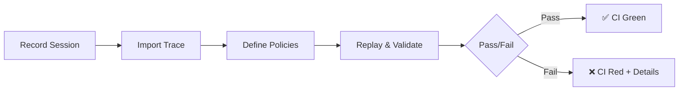

<h1 align="center">
  <br>
  
  <br>
  Assay
  <br>
</h1>

<p class="subtitle">The purity test for AI — Zero-flake CI for AI agents</p>

<div class="grid cards" markdown>

-   :material-clock-fast:{ .lg .middle } __Zero Flakiness__

    ---

    Tests run in **milliseconds**, not minutes. No API calls, no network, no random failures.

    [:octicons-arrow-right-24: How it works](#how-it-works)

-   :material-shield-lock:{ .lg .middle } __Privacy First__

    ---

    Runs entirely on `localhost`. Your traces never leave your perimeter. Enterprise ready.

    [:octicons-arrow-right-24: Air-gapped deployment](use-cases/air-gapped.md)

-   :material-protocol:{ .lg .middle } __MCP Native__

    ---

    Deep integration with Model Context Protocol. Validate tool calls, not text parsing.

    [:octicons-arrow-right-24: MCP integration](mcp/index.md)

-   :material-robot:{ .lg .middle } __Agent Self-Correction__

    ---

    Agents can validate their own actions at runtime before committing to them.

    [:octicons-arrow-right-24: Self-correction](mcp/self-correction.md)

</div>

---

## Quick Start

=== "Rust"

    ```bash
    cargo install assay
    ```

=== "Python"

    ```bash
    pip install assay
    ```

Then run your first test:

```bash
# 1. Import an MCP session
assay import --format mcp-inspector session.json --init

# 2. Run tests (instant, offline)
assay run --config mcp-eval.yaml --strict
```

[:octicons-arrow-right-24: Full installation guide](getting-started/installation.md)

---

## How It Works



**Traditional approach:** Every test calls the LLM → Slow, expensive, flaky.

**Assay approach:** Record once, replay forever → Fast, free, deterministic.

| Metric | Traditional | Assay |
|--------|-------------|-------|
| Test duration | 30s - 3min | **3ms** |
| Cost per run | $0.10 - $1.00 | **$0.00** |
| Flakiness | 5-20% | **0%** |
| Network required | Yes | **No** |

---

## Use Cases

### 1. CI Regression Gate

Catch breaking changes before they hit production.

```yaml
# .github/workflows/agent-tests.yml
- uses: Rul1an/assay-action@v1
  with:
    config: mcp-eval.yaml
```

[:octicons-arrow-right-24: CI integration guide](getting-started/ci-integration.md)

### 2. Trace-Driven Debugging

Reproduce failures from production logs.

```bash
assay import --format mcp-inspector user_bug_report.json
assay run --config mcp-eval.yaml --trace-file bug.jsonl
```

[:octicons-arrow-right-24: Debugging guide](use-cases/debugging.md)

### 3. Agent Self-Correction

Let agents validate their own actions at runtime.

```bash
# Start Assay as an MCP server
assay mcp-server --port 3001 --policy policies/
```

[:octicons-arrow-right-24: Self-correction guide](mcp/self-correction.md)

---

## Core Concepts

<div class="grid cards" markdown>

-   :material-file-document-multiple:{ .lg .middle } __Traces__

    ---

    Recorded agent sessions in a normalized format. The "golden" behavior you test against.

    [:octicons-arrow-right-24: Learn more](concepts/traces.md)

-   :material-shield-check:{ .lg .middle } __Policies__

    ---

    Rules that define "correct" behavior: argument schemas, sequence rules, blocklists.

    [:octicons-arrow-right-24: Learn more](concepts/policies.md)

-   :material-gauge:{ .lg .middle } __Metrics__

    ---

    Pure functions that validate output: `args_valid`, `sequence_valid`, `tool_blocklist`.

    [:octicons-arrow-right-24: Learn more](concepts/metrics.md)

-   :material-replay:{ .lg .middle } __Replay Engine__

    ---

    Deterministic replay without calling LLMs or tools. The core of zero-flake testing.

    [:octicons-arrow-right-24: Learn more](concepts/replay.md)

</div>

---

## Why "Assay"?

> *In metallurgy, an **assay** determines the purity of precious metals.*
>
> *In software, Assay determines the quality of your AI.*

We built Assay because existing LLM evaluation tools are:

- **Flaky:** They call live APIs, introducing network and model variance.
- **Slow:** Minutes per test, blocking CI pipelines.
- **Expensive:** $0.10-$1.00 per test run adds up fast.
- **Leaky:** They send your data to third-party observability platforms.

Assay fixes all of this by testing **locally**, **deterministically**, and **instantly**.

---

## Getting Help

- :fontawesome-brands-github: [GitHub Issues](https://github.com/Rul1an/assay/issues) — Bug reports and feature requests
- :fontawesome-brands-discord: [Discord](https://discord.gg/assay) — Community chat
- :material-email: [Email](mailto:hello@assay.dev) — Enterprise inquiries

---

<div class="grid cards" markdown>

-   :material-book-open-variant:{ .lg .middle } __Getting Started__

    ---

    Install Assay and run your first test in 5 minutes.

    [:octicons-arrow-right-24: Start here](getting-started/index.md)

-   :material-cog:{ .lg .middle } __Configuration__

    ---

    Learn how to write `mcp-eval.yaml` and policy files.

    [:octicons-arrow-right-24: Configuration](config/index.md)

-   :material-api:{ .lg .middle } __CLI Reference__

    ---

    Full documentation for all Assay commands.

    [:octicons-arrow-right-24: CLI Reference](cli/index.md)

-   :material-source-branch:{ .lg .middle } __Contributing__

    ---

    Help make Assay better.

    [:octicons-arrow-right-24: Contribute](contributing/index.md)

</div>
